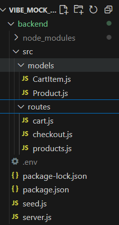
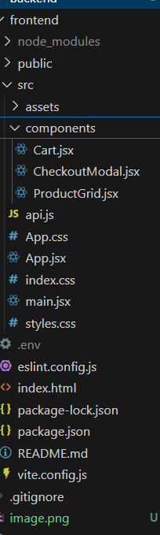

# 🛒 Vibe Commerce - Mock E-Com Cart

A full-stack shopping cart built for **Vibe Commerce** screening test.  
Implements essential e-commerce flows with **React (frontend)**, **Express (backend)**, and optional **MongoDB** persistence.

---

## ⚙️ Tech Stack
- **Frontend:** React + Axios + Vite
- **Backend:** Node.js + Express
- **Database:** MongoDB / Mock data
- **API Format:** REST (JSON)

---

## 🚀 Features
✅ Products grid with add-to-cart  
✅ Cart with quantity updates, remove items, and total  
✅ Checkout form (name + email)  
✅ Receipt modal (total, timestamp, details)  
✅ Responsive layout  
✅ Bonus: Error handling + DB persistence (optional)

---

## 🧩 Folder Structure



---

## ⚙️ Setup Instructions

### 🖥️ Backend
```bash
cd backend
npm install
npm start

cd frontend
npm install
npm run dev
By default: runs on http://localhost:5173